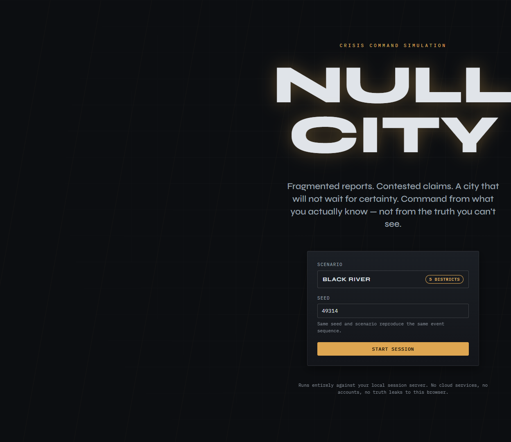
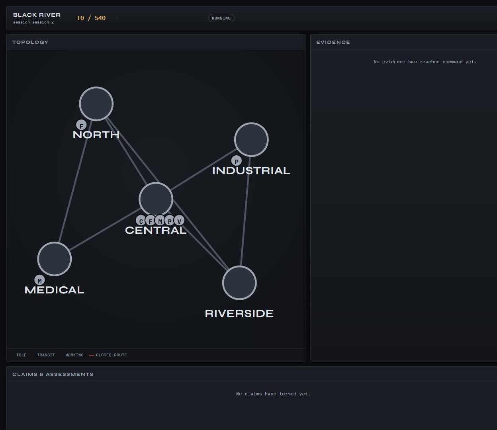
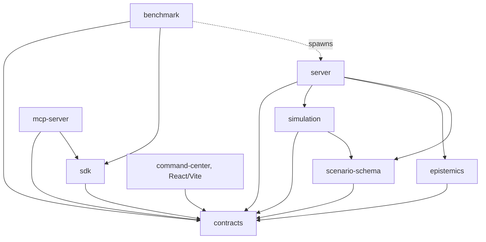

# NULL CITY

**A deterministic, partially observable crisis-response sandbox for testing decisions under uncertainty.**

> What you know is not what happened.

[MIT License](LICENSE) · [Architecture](docs/architecture.md) · [Protocol](docs/protocol.md) · [Benchmark](docs/benchmark.md) · [Threat model](docs/threat-model.md) · [Contributing](CONTRIBUTING.md)



Most agent demos reward fluent action in environments where the model can
read the state directly. NullCity tests a harder, more realistic problem:
acting while the world is hidden, reports arrive late, sources disagree,
resources are constrained, and early decisions trigger cascading failures —
the same city topology, run by a human, a scripted policy, or an LLM agent,
through one identical public interface.



## Truth, evidence, belief, action, replay

NullCity's whole design rests on keeping these five things separate, both
architecturally and in the UI:

| Concept | What it means here |
|---|---|
| **Truth** | The real, hidden simulation state — district attributes, active incidents, the seeded PRNG. Computed deterministically by `packages/simulation`, an internal, trusted-process-only value. **Active player surfaces never import or receive it**; a completed run artifact may carry truth for post-run Replay Lab analysis. |
| **Evidence** | A delivered report (sensor, dispatch, media, or citizen) with its own reliability, observed/delivered tick, and possible corruption or falsehood — never the truth value itself. |
| **Belief** | A `Claim` (with a `status`: reported → corroborated/contested → verified/refuted/stale) plus your own submitted `Assessment` (probability + confidence). This is what you actually act on. |
| **Action** | A `Command` (dispatch a team, reroute power, request verification, issue an advisory, ...) submitted through the one public `PlayerSession` contract — the same contract a human, the SDK, a benchmark policy, and an MCP agent all use. |
| **Replay** | Once a run completes, it becomes immutable and exports a verifiable run artifact. Replay Lab shows what was true, what you knew at each tick, what you believed, and which action changed the outcome — side by side. |

## Quickstart

Three commands, no account, no API key, no cloud service:

```bash
pnpm install
pnpm build
pnpm demo
```

`pnpm demo` starts the public server on `http://127.0.0.1:8787` and the
Command Center on `http://127.0.0.1:5173` — open that URL, pick a scenario
and seed, and play. Everything runs against your own local session server.
During an **active run**, no truth reaches the browser; after completion,
Replay Lab may load truth from a completed artifact for post-run analysis.

Prefer a container? `docker compose up --build` runs the same two services
(server on `:8787`, built Command Center on `:4173`) — see
[Packaging](#packaging) below. Docker is optional; the quickstart above
never requires it.

## Features

- **Hard truth boundary** — enforced by disjoint truth/public contracts and
  stores, plus black-box leak tests scanning every REST/WS/SDK/MCP payload
  (`docs/architecture.md`, `docs/threat-model.md`).
- **Reproducible world** — same compiled scenario + seed + command trace ⇒
  byte-identical canonical events and terminal digests (`pnpm verify:determinism`).
- **Epistemic gameplay** — claims and evidence with provenance and "as of
  tick" semantics, not a masked truth dashboard.
- **Verifiable completion** — a completed run is immutable, emits one
  terminal event, and exports a tamper-evident run artifact (`docs/protocol.md`).
- **Human/agent parity** — the browser client, TypeScript SDK, benchmark
  policies, and MCP adapter all consume the same `PlayerSession` contract.
  No agent-only endpoint exists.
- **Local-first** — the default demo needs no account, external database,
  cloud service, or model key.
- **Five distinct scenarios** — `black-river` (infrastructure cascade),
  `glass-harbor` (hazmat + false attribution + medical pressure),
  `signal-zero` (comms degradation + spoofed telemetry),
  `mirror-district` (mirrored accusations across a bridge chokepoint),
  `red-ledger` (ration ledger crash + ghost census) — see
  `docs/scenario-authoring.md`.
- **No source edit for new scenario content** — a new scenario ships as pure
  JSON under `scenarios/` and is immediately playable through the CLI, the
  server, the SDK, the MCP adapter, and the benchmark runner. The browser
  Command Center is the one exception: its launch picker and map render from a
  hand-authored topology in `apps/command-center/src/topology/`, so adding a
  scenario *to the browser UI* still needs a source edit there.

## Non-goals (v0.1)

Explicitly out of scope, per `00_NORTH_STAR.md`: hosted leaderboard,
authentication/accounts, multiplayer, cloud persistence, 3D/open-world
rendering, LLM-generated scenario logic, native desktop app, plugin
marketplace, and — most importantly — **any real-world emergency-service
integration or readiness claim.**

## Architecture



`simulation` never touches the network, filesystem, wall clock, or an LLM
provider. `command-center`/`sdk`/`benchmark`/`mcp-server` never import truth
types or the simulation/epistemics internals from their shipped `src/` —
enforced by a `forbidden-imports` test in every one of those packages. Full
detail, including the kernel's deterministic phase order and the
snapshot/run-artifact schemas: [`docs/architecture.md`](docs/architecture.md).

## Human and agent examples

**Human**, via the browser: `pnpm demo`, open `http://127.0.0.1:5173`, pick
`black-river`, seed `49314`, click **Start Session**.

**Agent**, via the TypeScript SDK — the exact same public contract:

```ts
import { createPlayerSession } from "@null-city/sdk";

const session = await createPlayerSession({
  baseUrl: "http://127.0.0.1:8787",
  scenarioId: "black-river",
  seed: 49314,
});

await session.submitCommand({
  commandName: "DISPATCH_TEAM",
  params: { teamId: "power-1", target: "industrial", task: "power_repair" },
});

await session.advance(30);
const state = await session.getState();
console.log(state.tick, state.claims.length, state.score.total);
```

Runnable end to end: `node packages/sdk/examples/quickstart.mjs` (after
`pnpm build`). The same session object is what
[`@null-city/mcp-server`](packages/mcp-server/README.md) exposes as nine
MCP tools (`get_state`, `submit_command`, `advance_time`, ...) to any
MCP-speaking LLM client, and what
[`@null-city/benchmark`](docs/benchmark.md)'s three deterministic baseline
policies (`noop`, `reactive-greedy`, `verification-first`) drive the five
shipped scenarios headlessly for scoring — no policy or MCP tool here ever
receives truth during an active run.

## Benchmark excerpt (generated from this codebase)

The table below is copied verbatim from `data/benchmark-smoke/report.md`,
produced by running `pnpm verify:benchmark` against this exact candidate
(command, exit code, and full per-run detail in `EVIDENCE.md`). Regenerate
it yourself with the same command.

| Scenario | Seed | Policy | Verified | Final Tick | Score | Cascades |
|---|---|---|---|---|---|---|
| black-river | 49314 | noop | yes | 540 | -295.10 | 2 |
| black-river | 49314 | reactive-greedy | yes | 540 | -143.61 | 2 |
| black-river | 49314 | verification-first | yes | 540 | -144.76 | 2 |
| glass-harbor | 49314 | noop | yes | 480 | -218.23 | 2 |
| glass-harbor | 49314 | reactive-greedy | yes | 480 | -40.66 | 2 |
| glass-harbor | 49314 | verification-first | yes | 480 | -15.49 | 2 |
| signal-zero | 49314 | noop | yes | 450 | -209.42 | 1 |
| signal-zero | 49314 | reactive-greedy | yes | 450 | -69.43 | 1 |
| signal-zero | 49314 | verification-first | yes | 450 | -49.16 | 1 |
| mirror-district | 49314 | noop | yes | 420 | -309.55 | 2 |
| mirror-district | 49314 | reactive-greedy | yes | 420 | -110.58 | 2 |
| mirror-district | 49314 | verification-first | yes | 420 | -49.76 | 2 |
| red-ledger | 49314 | noop | yes | 450 | -302.90 | 2 |
| red-ledger | 49314 | reactive-greedy | yes | 450 | -120.85 | 2 |
| red-ledger | 49314 | verification-first | yes | 450 | -73.55 | 2 |

`verification-first` is best on Glass Harbor, Signal Zero, Mirror District, and
Red Ledger in this matrix, and resolves claims (`resolved claims` ≥ 1) on every
scenario — the public `claimId` contract is live, not cosmetic. Black River
still prefers `reactive-greedy` by a small margin. Full metric reference:
[`docs/benchmark.md`](docs/benchmark.md); machine report:
`data/benchmark-smoke/report.md`.

## Integrity terminology and limitations

- **Tamper-evident, not a signature.** Every hash (`playerLogHash`,
  `artifactHash`, `RunReceipt.receiptHash`) is a SHA-256 hash chain: it
  proves a log was not altered after the fact, given a trusted value to
  compare against. It is **not** a cryptographic signature and proves
  nothing about *who* produced it unless a `signature` block is present
  and independently verified against a public key obtained outside the
  receipt — this repository does not ship a signing key or trusted root by
  default. See [`docs/protocol.md`](docs/protocol.md#integrity-terminology).
- **No real-world emergency-readiness claim.** NullCity is a benchmark and
  simulation sandbox. It is not validated against, and must not be
  represented as, an emergency-management or dispatch tool.
- **Benchmark fairness is scoped to what's shipped.** The three baseline
  policies and five scenarios in this repository are what the numbers
  above measure — no claim is made about performance on scenarios or
  policies not included here.
- **Browser Replay Lab verification is partial.** The Command Center checks
  artifact integrity and semantic bindings only (`PARTIAL` at best; never an
  unqualified full PASS). Authoritative verification — compiled-scenario
  truth replay plus player projection rebuild — is the CLI:
  `null-city-run verify --artifact <path>` (default `requireReplay`).
- **What this repository may claim** (verbatim from `00_NORTH_STAR.md`):
  *"NullCity is an open-source, local-first crisis decision benchmark with
  deterministic replay, strict information boundaries, human/agent parity,
  and verifiable run artifacts."* It may not claim real-world emergency
  readiness, cryptographic authenticity without a trusted signing flow, or
  benchmark fairness beyond the scenarios and metrics actually shipped.

## Packaging

Every workspace package exports only from `dist/` (`"files": ["dist"]`,
verified by `pnpm verify:tarball-smoke` — real `npm pack` → extract →
import, no leaked `src/`, no registry network access). Production start
commands: `pnpm server:start` (server only) or `pnpm demo` (server + UI).

```bash
docker compose up --build     # server on :8787, Command Center on :4173
pnpm release:archive          # data/release/null-city-v<version>.tar.gz + .sha256
```

Docker is covered by a required CI job (`.github/workflows/ci.yml`'s
`docker-smoke`) and is optional locally — `pnpm verify` never depends on it.
That job has not yet run on a real runner, because this tree has no remote to
push to; the container path is therefore reviewed and schema-validated, not
yet live-verified (see `STATUS.md` → "Unverified areas"). `engines.node`
(`>=20`) and `packageManager` (`pnpm@10.33.0`) in `package.json` are the
same versions CI and the `Dockerfile` pin to.

## Verification

```bash
pnpm install
pnpm verify
```

One command runs lint, typecheck, build, every package's unit/integration
tests, the determinism/invariant suites (same-seed determinism,
different-seed divergence, replay equivalence, snapshot/resume equivalence,
forbidden-randomness scan), REST/WS transport checks, package/tarball
smoke, all five scenarios' validation and golden receipts, the Replay Lab
artifact CLI, the Command Center's own typecheck/tests, the
SDK/benchmark/MCP quickstarts, and a 91-attack adversarial suite
(`pnpm verify:adversarial`) that tries to extract truth, break session
scope, mutate a completed run, and forge a resumed snapshot against the
real server — no Docker, no API key, no network access beyond the initial
install. Exact commands, exit codes, and result counts for the current
milestone are in [`EVIDENCE.md`](EVIDENCE.md); the adversarial findings,
including the two accepted limitations, are in
[`03_RELEASE_GATE.md`](03_RELEASE_GATE.md) and
`data/evidence/m8-adversarial/report.md`.

## Docs

- [`docs/architecture.md`](docs/architecture.md) — package map, dependency
  rules, kernel phases, truth/public contract split.
- [`docs/protocol.md`](docs/protocol.md) — REST/WS reference for writing a
  new client.
- [`docs/scenario-authoring.md`](docs/scenario-authoring.md) — schema,
  compiled format, CLI, diagnostics, starter template.
- [`docs/benchmark.md`](docs/benchmark.md) — baselines, metrics, and how to
  independently recompute a report.
- [`docs/scoring.md`](docs/scoring.md) — the scoring model.
- [`docs/threat-model.md`](docs/threat-model.md) — assets, trust
  boundaries, attacks, and mitigations.
- [`00_NORTH_STAR.md`](00_NORTH_STAR.md), [`01_TARGET_ARCHITECTURE.md`](01_TARGET_ARCHITECTURE.md),
  [`02_MILESTONE_ROADMAP.md`](02_MILESTONE_ROADMAP.md),
  [`03_RELEASE_GATE.md`](03_RELEASE_GATE.md) — product/engineering contracts
  this repository is built against.
- [`CONTRIBUTING.md`](CONTRIBUTING.md), [`SECURITY.md`](SECURITY.md),
  [`CODE_OF_CONDUCT.md`](CODE_OF_CONDUCT.md), [`CHANGELOG.md`](CHANGELOG.md),
  [`CITATION.cff`](CITATION.cff).

## License

[MIT](LICENSE)
