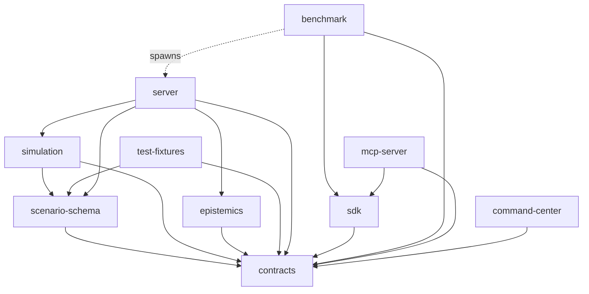

# Architecture

This document describes the shipped module boundaries and the invariants
they exist to enforce. For product framing see `00_NORTH_STAR.md`; for the
original target design see `01_TARGET_ARCHITECTURE.md`. This file describes
what the current code actually does, cross-referenced to real paths.

## Package map

```text
null-city/
├─ apps/
│  └─ command-center/     React/Vite browser client + Replay Lab
├─ packages/
│  ├─ contracts/           runtime (zod) schemas + public/internal TS types, canonical hashing
│  ├─ simulation/          deterministic kernel: engine, graph, PRNG, snapshot, receipt, replay, scoring
│  ├─ epistemics/          claims/evidence/assessment projection, truth→player event bridge, leak detector
│  ├─ scenario-schema/     source scenario schema, semantic compiler, CLI
│  ├─ server/              session hub, REST + WS transport, run artifact export
│  ├─ sdk/                 typed PlayerSession HTTP/WS client
│  ├─ benchmark/           policy runner, 3 baselines, metrics, reports
│  ├─ mcp-server/          MCP adapter over the SDK
│  └─ test-fixtures/       scenario registry + golden scripts shared by tests/CLIs
├─ scenarios/              black-river.json, glass-harbor.json, signal-zero.json (pure JSON)
├─ scripts/                demo, package/tarball/release, golden-receipts tooling
├─ docs/                   this file + protocol/benchmark/threat-model/scenario-authoring/scoring
└─ workpacks/, docs/decisions/, docs/audits/   milestone contracts, ADRs, inherited audit evidence
```

## Dependency direction



Enforced rules, each backed by a `test/forbidden-imports.test.ts` in the
relevant package:

- `simulation` never imports `server`, `sdk`, UI code, MCP code, an external
  model provider, or wall-clock/network/filesystem APIs.
- `command-center`, `sdk`, `benchmark`, and `mcp-server` never import
  `@null-city/simulation` or `@null-city/epistemics` from `src/`, and never
  reference a truth-only `@null-city/contracts` symbol. `@null-city/epistemics`
  and `@null-city/simulation` do appear as **dev**-only dependencies in some
  of these packages — only to run `detectPublicLeak` in tests or to spin up
  a real in-process server for integration tests — never from shipped `src/`.
- `server` is the one package allowed to hold both the truth engine
  (`SimulationEngine`) and the public projection
  (`projectPlayerState`/`epistemics`) in one process; every player-facing
  route (`packages/server/src/rpc.ts`, `http.ts`, `ws.ts`) returns only
  `PlayerSessionState`/`PlayerEventEnvelope` values, never a raw
  `EngineSnapshotData` or truth event. `GET /sessions/:id/snapshot` and the
  `session.snapshot`/`admin.snapshot` RPC ops are explicitly rejected on both
  REST and WS (`403 forbidden`); only an in-process caller can reach
  `hub`/`engine.snapshot()` directly.
- No cyclic package dependencies (checked implicitly by `tsc`'s project
  references failing to build on a cycle).

## Kernel phases

`packages/simulation/src/engine.ts`'s `SimulationEngine.step()` advances one
tick through a fixed phase order: accept due commands → schedule scenario
incidents/effects → advance teams → apply world effects/cascades → generate
observation-channel events → update incident response timelines → compute
score deltas → emit canonical truth events. All phase input is deterministic
state plus the engine's own seeded PRNG (`packages/simulation/src/prng.ts`);
nothing reads `Date.now()`, environment variables, or the filesystem during a
step.

## Truth vs. player contracts

Two disjoint schemas/stores, not one masked view:

- **Truth** (`packages/contracts/src/truth.ts`, internal to
  `simulation`/`server`): `TruthEvent`, `EngineSnapshotData`. Never
  serialized onto any player-facing route.
- **Public** (`packages/contracts/src/public.ts`, safe for
  `command-center`/`sdk`/`benchmark`/`mcp-server`): `PlayerSessionState`,
  `PlayerEventEnvelope`, `Claim`, `Evidence`, `Assessment`, `OwnTeamState`,
  `KnownRouteState`, `PublicScore`.

`packages/epistemics/src/bridge.ts` is the only place a truth event is read
to derive a player event; `packages/epistemics/src/project.ts`
(`projectPlayerState`) rebuilds `PlayerSessionState` purely by folding the
player event log — it never reads truth state. `packages/epistemics/test/project.test.ts`
and each player-facing package's own `test/leak.test.ts` (scanning every
response payload with `detectPublicLeak`) are the executable proof.

## Snapshot and run artifact

A snapshot (`EngineSnapshotData`, `packages/simulation/src/snapshot.ts`) is a
versioned, fully-serialized value bound to `scenario.digest`, `seed`, `tick`,
PRNG state, and event-chain counters — never a live object reference.
Resume (`SimulationEngine.fromSnapshot`) validates structure, digest match,
and chain invariants before constructing an engine.

A completed run's artifact (`packages/server/src/artifact.ts`,
`buildSessionArtifact`) is only released once `phase === "completed"` (see
`docs/protocol.md`'s `GET /sessions/:id/artifact`) and bundles both the
truth and player event logs plus their hashes — the mechanism Replay Lab
uses to show a truth-vs-belief comparison after the fact, without ever
exposing truth during an active run.

## Packaging

Every publishable workspace package (`contracts`, `epistemics`,
`scenario-schema`, `simulation`, `server`, `sdk`, `benchmark`, `mcp-server`,
`test-fixtures`) declares:

- `"main"`/`"types"`/`"exports"` pointing only at `./dist/*` — never `src/`,
  never a `ts-node`/`tsx` loader requirement for a consumer;
- `"files": ["dist"]`, so `npm pack`/`pnpm pack` never includes `src/` or
  dev tooling (verified by `pnpm verify:tarball-smoke`, which packs,
  extracts, and imports real tarballs with no registry network access);
- a `"build"` script (`tsc -p tsconfig.json`) and, where the package has a
  CLI, a `"bin"` entry pointing at built `dist/cli*.js`.

`engines.node` (`>=20`) and `packageManager` (`pnpm@10.33.0`) in the root
`package.json` are the floor versions CI (`.github/workflows/ci.yml`) and
the `Dockerfile` both pin to, so "supported" is one coherent claim, not three
different ones across docs/CI/Docker.

## Command Center and Replay Lab

`apps/command-center` (React + Vite) never imports `@null-city/simulation`
or `@null-city/epistemics` (enforced by its own `test/forbidden-imports.test.ts`)
— it drives everything through `fetch`/WebSocket calls to the same REST/WS
surface the SDK wraps. Its topology modules
(`src/topology/{blackRiver,glassHarbor,signalZero}.ts`) hold only district
ids/labels and route endpoints (structural, not truth-attribute data),
selected per scenario via `src/topology/registry.ts`. Post-completion, the
same app's Replay Lab view loads the run artifact and renders the
synchronized truth/player/assessment timeline described above.
